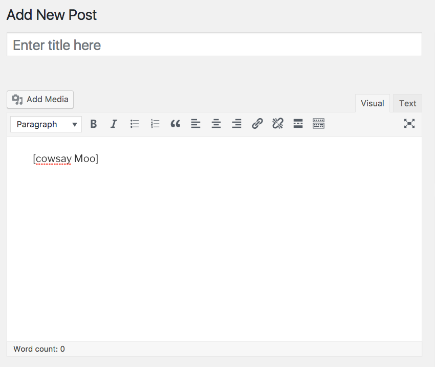
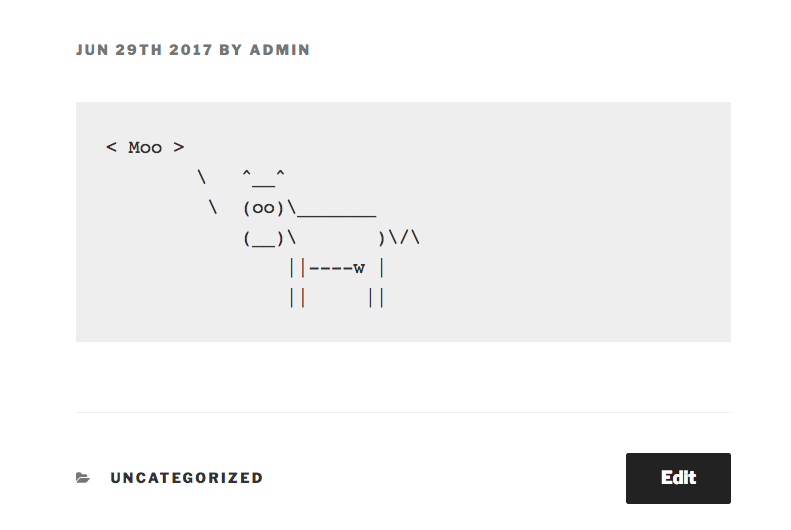

# WP Cowsay

[](https://travis-ci.org/kamataryo/wp-cowsay)
[](https://wordpress.org/plugins/wp-cowsay/)

## Official Repository

https://wordpress.org/plugins/wp-cowsay/

## Contributing

```
$ git clone https://github.com/kamataryo/wp-cowsay
$ cd wp-cowsay
$ curl https://raw.githubusercontent.com/kamataryo/travis-sctipts-collection/master/install-wp-tests.sh > ./install-wp-tests.sh
$ bash ./install-wp-tests.sh wordpress_test root '' localhost $WP_VERSION
$ composer install
$ phpunit
```

## Screen shots

1. type a short code.


1. Cow says!

